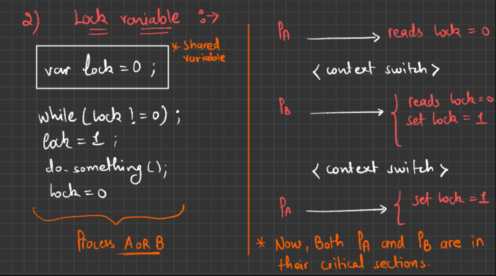
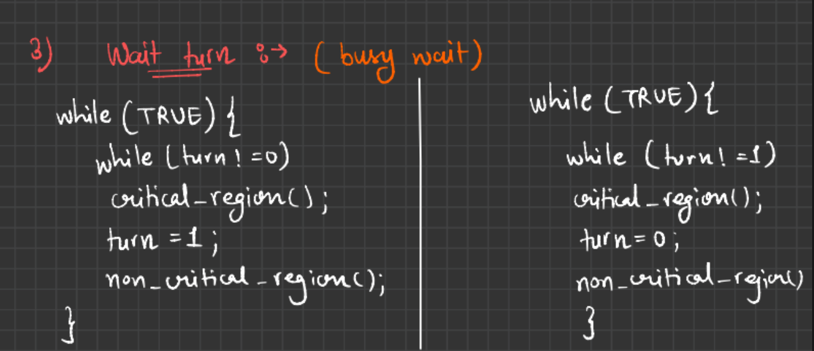
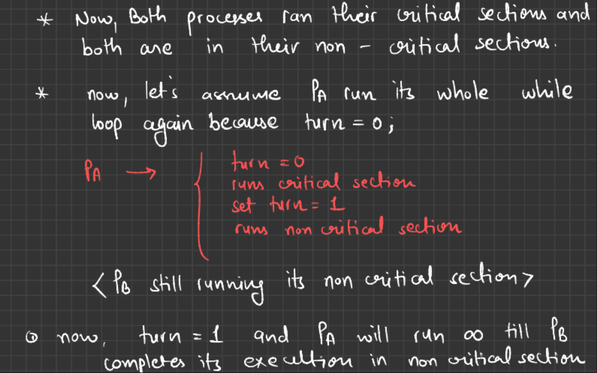

## Critical Section

A critical section is a part of a program where shared resources (like variables, files, or printers) are accessed or modified. To prevent race conditions, only one thread or process should enter the critical section at a time.

#### Why It Matters:

In concurrent programming, multiple processes/threads may try to read or write shared data. If two or more do this at the same time, data inconsistency can occur. The critical section is protected to ensure mutual exclusion.

### Four conditions for a good solution of critical section.

#### 1. Mutual Exclusion

    "No two processes must be inside the critical section at the same time."

    Goal: Prevent race conditions.

    Ensures only one process/thread can access the shared resource at a time.

#### 2. Progress

    "No assumptions should be made about the speed of CPUs or number of processors."

    The system must work regardless of processor speed or how many CPUs are running.

    If no process is in the critical section, and some processes want to enter, one of them must eventually get access.

#### 3. Bounded Waiting (No Starvation)

    "No process should wait forever to enter its critical section."

    Every process gets a fair chance.

    There is a limit on the number of times other processes can enter their critical sections before a waiting process gets in.

#### 4. No Preemption

    "A process not in its critical section must not block others."

    If a process is doing non-critical work, it shouldn't affect others entering their critical sections.

    This prevents unnecessary delays.

### Some solutions to mutual exclusions.

### 1. Disabling Interrupts 

#### Idea Behind "Disabling Interrupts":

    * When a process enters its critical section, it disables CPU interrupts.

    * This prevents the OS from performing a context switch to another process.

    * As a result, the current process finishes its critical section without interference.

#### Problems with This Approach (as in your notes):

##### 1. Infinite Loop Problem:

        *   “If a process goes into an infinite loop, no one can stop it.”

        *   Since interrupts are disabled, even the OS can’t regain control to preempt the process.

        *   This can cause the system to hang or become unresponsive.

##### 2. Multiprocessor Problem:

        *   “If one process runs on CPU1 and another on CPU2, shared memory is still accessible.”

        *   Disabling interrupts only affects the CPU it's called on, not the entire system.

        *   On a multi-core or multi-CPU system, another processor can still run and access the critical section, breaking mutual exclusion.

### 2. Lock Variables.

#### Approach :-

#### Code :-
    In lockVariable.cpp

#### Problem
While(lock != 0); loop and lock = 1; update are not atomic. These operations are not atomic, meaning:

    Two threads can both see lock == 0 at the same time,

    And both enter the critical section,

    Causing corruption of shared data x.

### 3. Wait Turn

#### Approach :-

#### Code
    In waitTurn.cpp

#### How it avoids need to be atomic.

    The turn of the thread is not set by itself, instead it is set by other thread.

    When one task completes it changes the turn to other

    In this way, the requirement of atomicity is avoided.

#### Problem 

##### What is a Spinlock?

A spinlock is a simple synchronization mechanism where a thread repeatedly checks (or "spins" on) a condition until it becomes true — allowing it to enter the critical section.

    It does not sleep or get blocked.

    The thread just keeps running in a loop, consuming CPU cycles, until it gets the lock.

    Busy Waiting

Non-Critical Section block the critical section of other.

### 4. Peterson Solution

It is mutual exclusion solution for two process.

#### Code 
    In peterson.cpp

#### Problems 

    1. Only valid for two process/thread
    2. Busy waiting in critical section.

#### Idea 

    Use two variables.

    * Turn == Process means it is this process's turn to wait.
    * Interested[process] == true means either in critical section or interested

    1. Turn == Other means i.e, Turn != Process means it is other process's is waiting, that means other process is not in critical section. So we can enter critical section.

    2. Interested[other] == False means other process is out of critical section.

    * So for any of the above conditions, we can enter critical section.

### 5. TSL Instructions

TSL stands for Test-and-Set Lock. It is an atomic machine instruction used in low-level concurrent programming (e.g., in operating systems) to achieve mutual exclusion — i.e., to prevent race conditions by ensuring only one process enters the critical section at a time.

#### How TSL Works:

The TSL instruction typically does two things atomically:

    Reads the value from a memory location (usually a lock).

    Sets the value of that memory location to a non-zero (locked) value.

Because both actions happen as a single atomic instruction, no other process can interrupt it halfway.

#### What Hardware Does Differently

A hardware-level TSL (Test-and-Set Lock) instruction:

    Is implemented directly by the CPU

    Performs both test and set in a single, uninterruptible instruction cycle

This prevents other threads or processors from modifying the memory location during the operation.

#### Problems :-
    Busy Waiting In Critical Section

### Priority Inversion Problem

Priority Inversion is a synchronization problem in real-time and concurrent systems where:

    A low-priority process holds a lock needed by a high-priority process, but the high-priority process gets blocked because the OS lets a medium-priority process run instead.

### 6. Sleep and Wakeup

Sleep and wakeup refer to inter-process communication primitives used to avoid busy waiting when a process cannot proceed.

#### Sleep

    A process goes to sleep when it cannot continue because a condition is not met (e.g., a buffer is empty or full).

    It gives up the CPU and is blocked, allowing other processes to run.

    It stays in the sleep (blocked) state until some other process wakes it up.

#### Wakeup

    A process wakes up another process (or all waiting processes) when a condition becomes true.

    It moves the sleeping process to the ready queue, making it eligible to be scheduled again.

#### More
    More about sleep and wakeup in Producer Consumer Problem.

