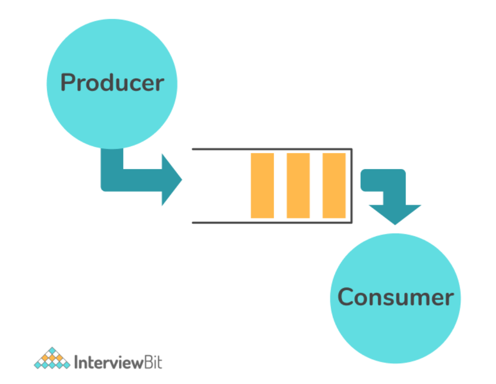

## Producer Consumer Problem

Producer-Consumer Problem is also known as the bounded buffer problem. The Producer-Consumer Problem is one of the classic problems of synchronization.

There is a buffer of N slots and each slot is capable of storing one unit of data.

There are two processes running, i.e. Producer and Consumer, which are currently operated in the buffer.

There are certain restrictions/conditions for both the producer and consumer process so that data synchronization can be done without interruption. These are as follows:

    1. The producer tries to insert data into an empty slot of the buffer.

    2. The consumer tries to remove data from a filled slot in the buffer.

    3. The producer must not insert data when the buffer is full.

    4. The consumer must not remove data when the buffer is empty.

    5. The producer and consumer should not insert and remove data simultaneously.

### Solution - Sleep and Wakeup ?

Race conditions are still possible in the producer-consumer problem even when using sleep and wakeup, if they are not used correctly or are not atomic.

#### Why?

Sleep() and Wakeup() are not atomic operations. That means there is a gap between checking the condition (like buffer full/empty) and going to sleep. If a context switch happens in that gap, a race condition can occur.

### Semaphores

A semaphore is a synchronization tool used in operating systems to control access to shared resources and prevent race conditions.

    A semaphore couples the sleep and wakeup operations with the conditional check into one atomic process.

Operations on Semaphore

A semaphore S supports two atomic operations:

#### 1. wait(S) – Also called P(S) or down(S)

    Decrements S.

    If S < 0, the process is blocked and added to the waiting queue.

#### 2. signal(S) – Also called V(S) or up(S)

    Increments S.

    If S ≤ 0, a blocked process is woken up.

