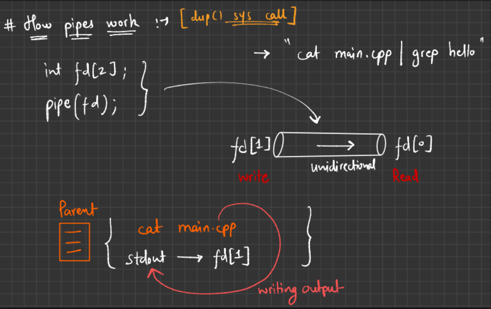
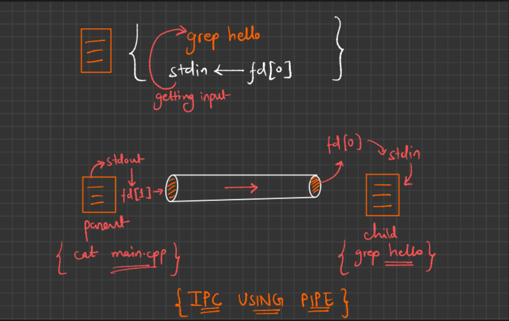

## Inter Process Communication

Interprocess Communication (IPC) refers to the mechanisms an operating system provides to allow processes to communicate and coordinate with each other.

| IPC Mechanism      | Description                                               |
| ------------------ | --------------------------------------------------------- |
| **Pipes**          | Unidirectional channel for data between related processes |
| **Message Queues** | Send/receive structured messages                          |
| **Shared Memory**  | Fastest IPC method – processes share a memory segment     |
| **Semaphores**     | Used for synchronization (not direct communication)       |
| **Sockets**        | Allow communication over a network                        |
| **Signals**        | Used to notify a process that an event occurred           |

### Example:

#### Grep Command.

    grep "hello" file.txt

Shows all lines in file.txt that contain "hello".

#### Cat Command.

    cat main.txt | grep hello

“Take the content of main.cpp and search for lines that contain the word hello.”

#### Breakdown:

    cat main.cpp
    → Outputs the entire content of main.cpp.

    | (pipe)
    → Sends that output as input to the next command.

    grep hello
    → Filters and prints only the lines containing "hello".

### 1. Pipe Operator in Terminal

A pipe (|) in Linux is used to connect the output of one command to the input of another.

It allows you to chain commands together so the output of one becomes the input of the next — like a real pipe carrying water between tanks.

### 2. Pipe() System Call

The pipe() system call is used to create a unidirectional communication channel between two processes — typically a parent and its child.

It sets up a pipe, which has:

    1, A read end

    2. A write end

#### Syntax:

    int pipe(int pipefd[2]);

#### Parameters:

    pipefd: An array of two integers.

        pipefd[0]: read end of the pipe

        pipefd[1]: write end of the pipe

#### Return Value:

    On success: Returns 0, and fills pipefd[0] and pipefd[1].

    On failure: Returns -1 and sets errno.

#### Implementation (of Pipe Operator by using pipe system call): 

    In Pipe.c

